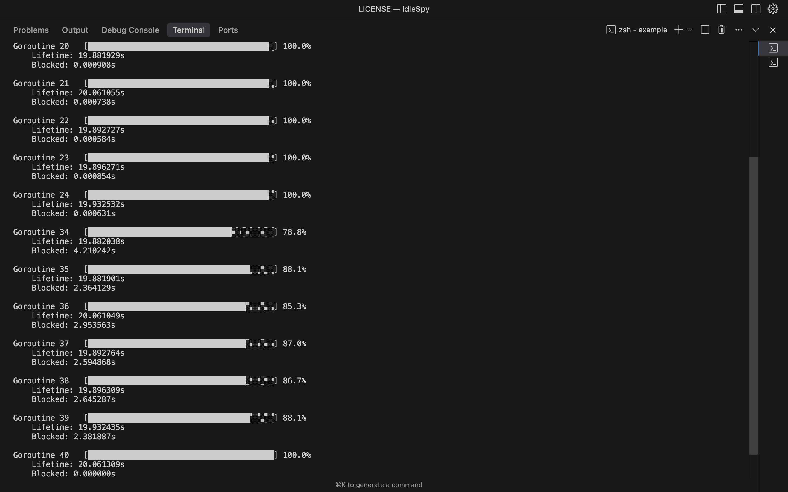

## IdleSpy: Visual Concurrency Profiler for Go

IdleSpy is a Go library and CLI tool for analyzing goroutines in high-concurrency applications. It shows where time is spent inside select statements and how often each path is blocked, helping you quickly identify inefficiencies and improve concurrency performance.

### 🔍 What IdleSpy Tracks

- **Goroutine Lifetime**: Start, end, and total duration.
- **Select Case Activity**: How many times each case is hit and how long it blocks.
- **Blocking Behavior**: Tracks average, total, and percentile (P90/P99) blocked times per select case.

### 📊 CLI-Generated Charts

IdleSpy's CLI can generate insightful graphs like:

- **`score`** – Efficiency score per goroutine (total lifetime vs blocked time).
- **`total-blocked-time`** – Cumulative blocked time per select case across all goroutines.
- **`avg-blocked-time`** – Average blocking duration per case across all goroutines.
- **`p90-blocked-time` / `p99-blocked-time`** – Long-tail blocking outliers across all goroutines.
- **`hits`** – Frequency of each case execution across across all goroutines.

> Note: Use these charts to identify bottlenecks, uncover starvation issues, and fine-tune your system's concurrency design.

#### Graph Example



This graph shows the efficiency score distribution across goroutines, where higher scores indicate better utilization (less blocking time relative to total lifetime).

## Installation

```bash
go get github.com/AlexsanderHamir/IdleSpy/tracker
go install github.com/AlexsanderHamir/IdleSpy/cmd/idlespy@latest
```

## Tracker Usage

IdleSpy provides a simple API to track goroutine behavior in your Go applications. Here's how to use it:

### Basic Usage

```go
import (
	"github.com/AlexsanderHamir/IdleSpy/tracker"
	"time"
)

// Create a new goroutine manager to track statistics
stats := tracker.NewGoroutineManager()

// Example of tracking a select statement
func processItem(ctx context.Context, item WorkItem, output chan<- WorkItem) {
	startTime := time.Now()
	select {
	case output <- item:
		// Track successful send with case name and blocking duration
		stats.TrackSelectCase("output_send", time.Since(startTime))
	case <-ctx.Done():
		// Track context cancellation
		stats.TrackSelectCase("context_cancelled", time.Since(startTime))
		return
	}
}
```

## CLI Usage

Use the CLI tool to generate visualizations of your tracking data:

```bash
# Generate efficiency score chart
idlespy -file ./stats.txt -chart score

# View blocking time distribution across select cases
idlespy -file ./stats.txt total-blocked-time
```

> Note: Run `idlespy -help` for more.

### Understanding the Statistics

The tracker will generate the following statistics and save it on the stats.txt file:

```
Goroutine 35:
Lifetime: 19.88s
Total Select Blocked Time: 2.36s

Select Case Statistics:
slow_path_output:
  Hits: 51
  Total Blocked Time: 2.36s
  Average Blocked Time: 46.34ms
  90th Percentile: 88.35ms
  99th Percentile: 93.23ms

batch_timeout:
  Hits: 58
  Total Blocked Time: 274.84µs
  Average Blocked Time: 4.74µs
  90th Percentile: 8.17µs
  99th Percentile: 12.83µs

Goroutine 100:
.....
```

### Best Practices

1. **Meaningful Case Names**: Use descriptive names for your select cases to make analysis easier
2. **Track All Cases**: Include tracking for all select cases, including timeouts and cancellations
3. **Consistent Timing**: Always measure from the start of the select statement
4. **Goroutine Management**: Create a new `GoroutineManager` for each logical component of your application

## Contributing

Share your talents and ideas!!

## License

This project is licensed under the MIT License - see the [LICENSE](LICENSE) file for details.
